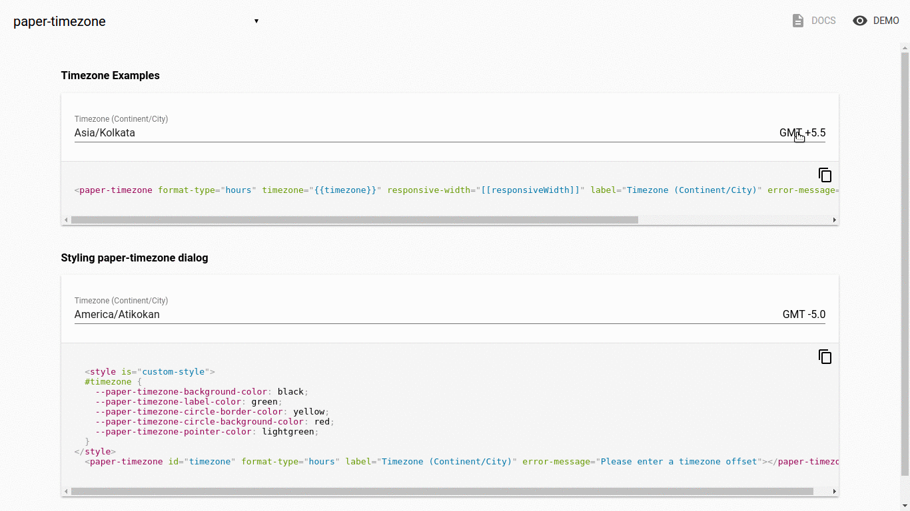

[](https://www.webcomponents.org/element/bluewatertracks/paper-timezone)

# paper-timezone

## About

paper-timezone is a Polymer based web component used for interactively selecting a timezone locale from a map. On smaller screens, the component resizes itself to a dropdown with the ability to let the user select the locale from the dropdown list. It is heavily inspired by the world map on the momentjs site; it in fact is a rewrite of the same in Polymer although with a lot more added features.

We at Blue Water Tracks use it on our portal pages and we wanted to open source the component to share it with the Polymer community.Demos and documentation can be found [here](http://bluewatertracks.github.io/paper-timezone/components/paper-timezone/)



Screenshot in mobile view

<p align="center">
  
</p>

## Features
 - Extremely simple to set up.
 - Support for desktop and mobile mode using the ```responsive-width``` property.
 - Moment compatible object  ```{location: "Asia/Bangkok", offset: 420}```
 - Support for offset in minutes or hours.
 - Support for custom styling.

## Installation

The element can be installed using bower using

    bower install --save paper-timezone

## Usage

- Following code is required to place in the polymer web component.
```html
    <paper-timezone  name="timezone" timezone="[[timezone]]" label="Timezone (Continent/City)" error-message="Please enter a timezone offset"></paper-timezone>
```    
- It is used to select timezone offset from dialog or dropdown.
Check out the [getting started guide](http://bluewatertracks.github.io/paper-timezone/components/paper-timezone/).

## Reporting Bugs

When filing a bug report, please provide an example of how to reproduce using
plunker, jsbin, jsfiddle, etc.


## Testing

To run the tests go to the component directory and run.
```html
    polymer test
```    

## License

This project is licensed under the terms of the MIT license.

## Contributing

We absolutely love sending us new pull requests, so let us just outline some advice:

 1. If you have an idea for a feature that you would like to be added or have a pull request for one, create an issue and we will have
 a look at it and let you know if we can support it.  
 2. You have to explicitly agree in your pull request to the terms described in the
    [fair share license construction](https://github.com/).

## Contributors

|||
|----------|:-------------:|------:|
|  |  Programming is like playing chess; each line is as important as each step to determine what kind of player or programmer you are. When ever not playing chess, it's Javascript, Java and mongodb.
|  |  Javascript Ninja; saving the world with one line of javascript at a time. ;) 
|  | What is my opinion about JavaScript, NodeJS, MongoDB and Polymer? Building blocks to the future! Allowing me to help make the world a better place.
|


